# DOS_Helltaker

**2025/01/23 [포텐업] 게임 개발자 양성 과정**

---

## 1. 프로젝트 개요

### 1-1. 구현 게임

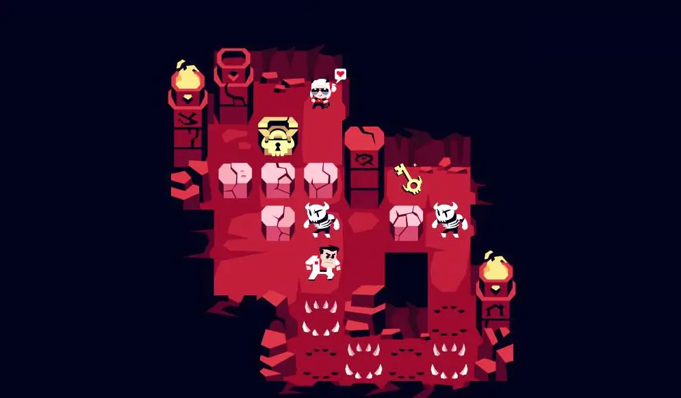

Steam 무료 인디 게임 **HELLTAKER**

**게임 장르 : 턴제 퍼즐 어드벤처**

* **핵심 게임 플레이 특징**
  * 제한된 이동 횟수 내에서 퍼즐 해결
  * 바위 밀기, 스켈레톤 처치, 열쇠/문 시스템, 가시 함정
  * 최종 목표인 악마에게 도달하기

### 1-2. 선정 이유

**소코반 게임을 기반으로 한 게임인 만큼 로직이 매우 동일하다.**

- 첫 프로젝트인 만큼 학습을 목표로 차근차근 하나 씩 구현한다고 생각했다.

### 1-3. 개발 환경

* 사용 언어 : C++
* 개발 도구 : Visual Studio
* 시스템 사양
  * 콘솔 기반 텍스트 그래픽
  * 키보드 입력 지원
  * Windows 콘솔 환경

## 2. 게임 구성 요소

### 2-1. 게임 플레이 메커니즘

* 핵심 조작 방식
  * 방향키로 캐릭터 이동
  * ESC키로 메뉴 호출
  * Enter키로 메뉴 선택

* 게임 규칙
  * 각 스테이지별 제한된 이동 횟수 내에서 퍼즐 해결(15~40회)
  * 장애물 상호작용 시스템
  * 열쇠 수집 및 잠긴 문 개방 메커니즘

* 승리/패배 조건
  * 승리 : 스테이지의 목표 지점(악마 캐릭터)에 도착
  * 패배 : 이동 횟수 소진

### 2-2 기술적 구현

* 그래픽 처리
  * ASCII 문자 기반 렌더링 시스템
  * 각 액터 별 고유 심볼 사용
    * 플레이어(●), 악마(♥), 벽(#), 상자(■), 스켈레톤(◆), 가시(▦), 열쇠(§), 문(□)
  * 컬러 처리 : White, Blue, Green, Red로 구분
* 입력 처리
  * Windows API 키보드 입력 감지

* 충돌 처리
  * 격자 기반 위치 확인
  * 액터 간 상호작용 규칙 구현

## 3. 개발 과정

#### **이동 횟수 추가 및 게임 오버 추가**

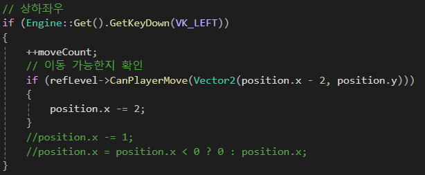

moveCount 변수 선언 및 키보드 입력을 받으면 값을 1 씩 증가

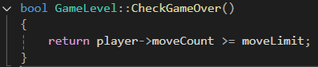

moveLimit 값보다 moveCount 값이 더 커지면 true 반환

#### **구현되어 있는 액터 로직 변경**

 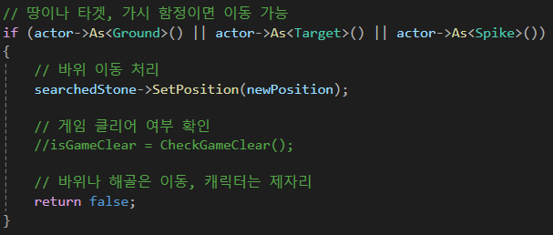

바위, 스켈레톤을 밀 때 바위나 해골은 이동하지만 캐릭터는 이동하면 안된다.

#### **신규 액터 추가 (스켈레톤, 가시 함정, 열쇠, 문, 악마)**

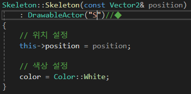

기존 액터들과 같은 형식으로 추가

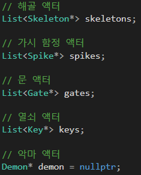

악마는 스테이지 당 1명

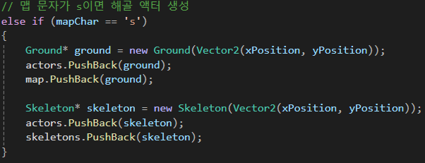

스켈레톤, 열쇠, 문은 바위와 같이 땅 위에 덮어쓰는 형태로 생성

스켈레톤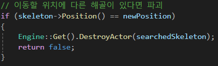은 바위와 다르게 밀리는 방향에 이동 불가 장애물이 있을 시 파괴

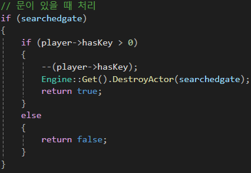

문은 열쇠가 있으면 열쇠 개수를 하나 줄이고 사라짐, 없으면 이동 불가

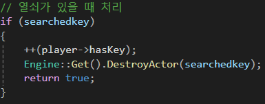

열쇠는 충돌 시 사라지며 열쇠 개수 하나 증가

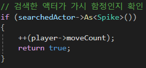

가시 함정은 충돌 시 moveCount 값 1 더 증가

#### **스테이지 구상 및 txt파일 추가**

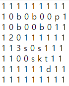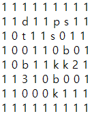

텍스트 파일에 위와 같이 텍스트 작성

#### **스테이지 클리어 및 전환 추가**

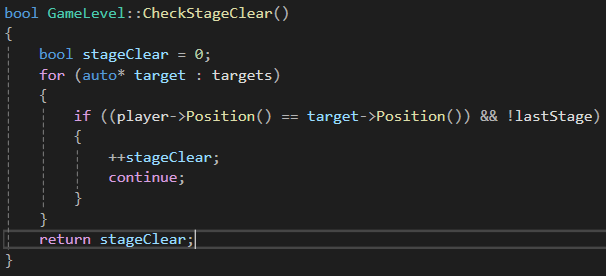

마지막 스테이지 (현 프로젝트에선 4번째 스테이지)를 클리어 시 lastStage 값이 True로 변경되므로 조건문을 위와 같이 작성

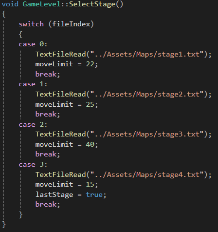

기존에 있던 파일 입출력을 const char* 타입의 인수를 받는 함수로 만들어 switch 문으로 스테이지 전환

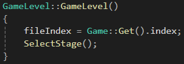

GameLevel을 만들 때 SelectStage 함수를 호출

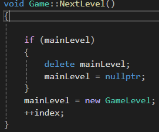

Game 클래스의 NextLevel 함수를 만들고 새로운 레벨 만들기 및 삭제 기능 구현

 

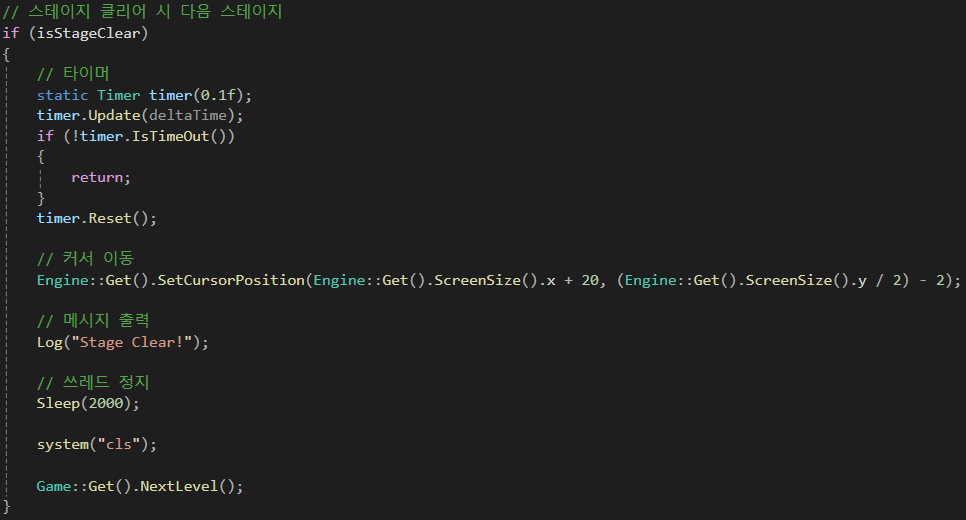

스테이지 클리어 시 NextLevel 함수 호출

#### **게임 클리어 로직 변경**

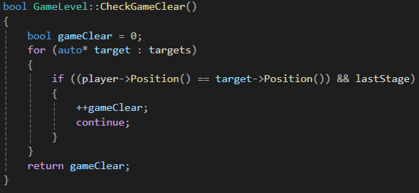

마지막 스테이지 클리어 시 lastStage가 True로 할당되고 게임 클리어

#### **메인 메뉴 추가**

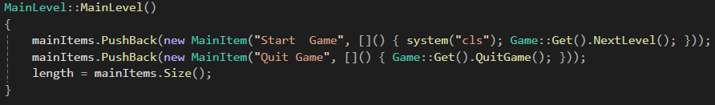

Mainmenu 클래스 및 함수 추가

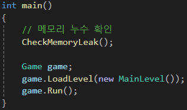

Main.cpp 실행 시 new MainLevel을 만들어서 LoadLevel로 호출

## 4. 시연

**메인 메뉴**

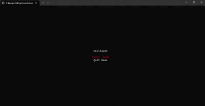

**바위 충돌**

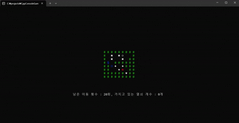

**문 충돌**

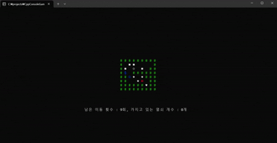

**가시 함정, 열쇠 2개 획득**

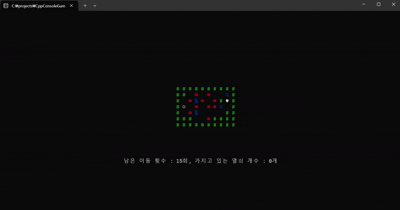

**스테이지 전환**

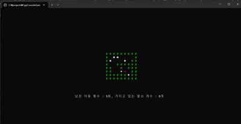

 **1스테이지 클리어**

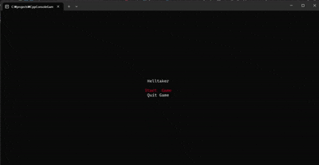

**게임 클리어**

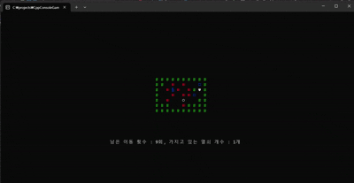

## 5. 향후 개선 방향

### 5-1. 추가 기능

* 사운드 시스템 구현
* 애니메이션 효과 추가
* 추가 스테이지 제작
* 스테이지 클리어 후 스토리 레벨 제작
* 저장 및 불러오기
